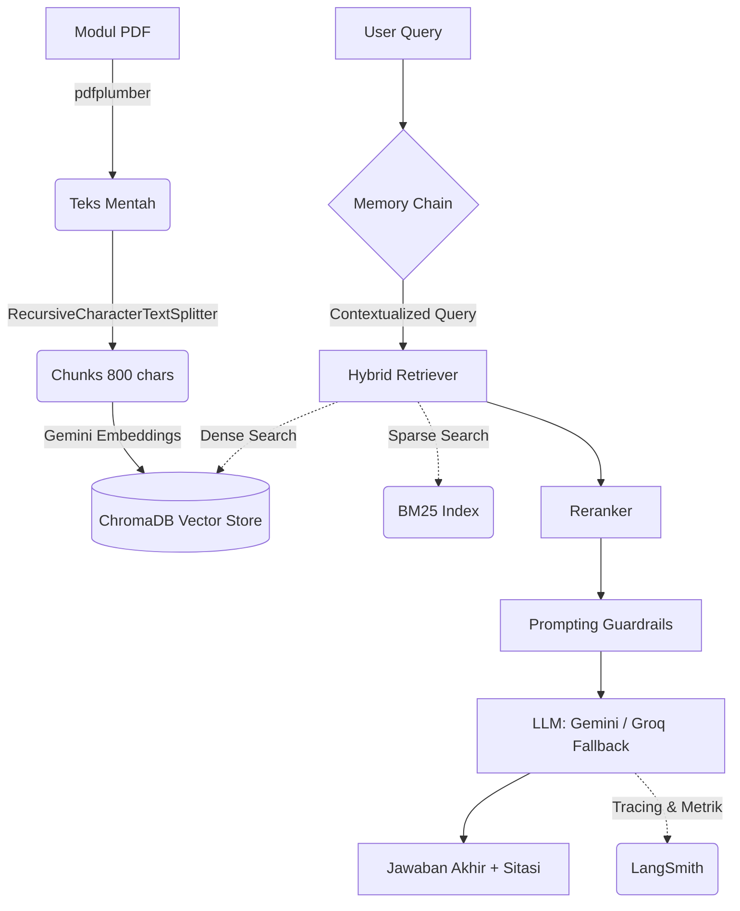

# Chatbot RAG "Accurate Online" (Take-Home Test AI Engineer)
Gerald Dustin Albert - albertgerald26@gmail.com - 085156183013

Repositori ini memuat prototipe Chatbot RAG (Retrieval-Augmented Generation) berbasis Python yang mampu menjawab pertanyaan terkait *Accurate Online* berdasarkan dokumen modul resmi.

🌍 **Live Demo:** [https://accurate-chatbot-gerald.streamlit.app/](https://accurate-chatbot-gerald.streamlit.app/)

Prototipe ini dirancang untuk meraih semua **Kebutuhan Wajib (W1-W6)** dan mengimplementasikan **Nilai Tambah (N1-N5)**.

---

## 1. Cara Menjalankan dari Nol

### Persyaratan
- Python 3.10 hingga 3.12 (Penting: Versi 3.13+ atau 3.14 ke atas mungkin gagal saat menginstal dependensi seperti `Pillow` dan `pdfplumber` di Windows karena belum ada *pre-built binaries*).
- Akun Google Gemini (Gratis) untuk API Key.
- Akun Groq (Opsional, untuk fallback).

### Langkah-langkah
1. **Clone repositori dan masuk ke direktori:**
   ```bash
   cd chatbot-accurate
   ```

2. **Buat dan aktifkan virtual environment:**
   ```bash
   # Windows
   python -m venv .venv
   .venv\Scripts\activate
   
   # Mac/Linux
   python3 -m venv .venv
   source .venv/bin/activate
   ```

3. **Install semua dependensi:**
   ```bash
   pip install -r requirements.txt
   ```

4. **Konfigurasi Environment Variable:**
   Copy file `.env.example` menjadi `.env` lalu masukkan API Key Anda:
   ```env
   GOOGLE_API_KEY=your_gemini_api_key_here
   GROQ_API_KEY=your_groq_api_key_here
   # (Opsional) Tambahkan LANGCHAIN_API_KEY untuk LangSmith
   ```

5. **Jalankan Data Ingestion (Ekstraksi & Indexing):**
   Pastikan file `MODUL PEMBELAJARAN.pdf` berada di dalam folder `data/`. Lalu jalankan:
   ```bash
   cd src
   python ingest.py
   ```
   *Skrip ini akan memproses PDF dan membuat folder `chroma_db` (Vector Database).*

6. **Jalankan Aplikasi Chatbot (Streamlit):**
   ```bash
   # Dari root directory
   streamlit run app.py
   ```
   Aplikasi akan terbuka otomatis di browser (biasanya di `http://localhost:8501`).

---

## 2. Alur Arsitektur

### Diagram Alur


**Penjelasan Singkat:** Dokumen PDF dibaca dan dipecah, lalu diindeks ke dalam basis data vektor lokal (ChromaDB) dan BM25 corpus. Saat pengguna bertanya, RAG Pipeline menggunakan *Hybrid Search* (gabungan vektor semantik dan *keyword* leksikal) untuk menemukan konteks paling relevan. Jika ada riwayat percakapan, sistem akan merumuskan ulang pertanyaan (Contextualizing Question) sebelum pencarian. Terakhir, Gemini menghasilkan jawaban murni berdasarkan konteks beserta rujukan halamannya.

---

## 3. Keputusan Teknis & Alasannya

*   **Pilihan Jalur**: Menggunakan **Python + LangChain** (Jalur A) karena memberikan fleksibilitas tertinggi untuk mengimplementasikan *Hybrid Search* dan evaluasi *RAGAS* yang sulit dicapai jika hanya mengandalkan *drag-and-drop* di n8n.
*   **LLM & Embeddings**: Menggunakan **Google Gemini Pro** dan `models/embedding-001` via `langchain-google-genai` karena sangat handal untuk Bahasa Indonesia, memilik *context window* yang besar, dan memiliki *tier* gratis. Sebagai cadangan, jika Gemini terkena *rate limit*, sistem akan melakukan _fallback_ ke **Groq (Llama-3)** yang sangat ringan dan cepat.
*   **Strategi Chunking**: `RecursiveCharacterTextSplitter` dengan `chunk_size=800` dan `chunk_overlap=200`. Ukuran 800 cukup untuk memuat 2-3 paragraf utuh yang kontekstual, sedangkan *overlap* 200 karakter mencegah terpotongnya informasi teknis atau prosedur di tengah kalimat.
*   **Mekanisme Memori**: Tidak menggunakan *window buffer* biasa, melainkan pola `create_history_aware_retriever`. Pola ini mengirimkan riwayat percakapan + pertanyaan baru ke LLM untuk menghasilkan satu kueri *standalone*. Ini sangat efektif untuk pertanyaan lanjutan seperti *"bagaimana dengan yang kedua tadi?"*.
*   **Zero-Lag UI Architecture**: Karena Streamlit secara bawaan melakukan *full-page refresh* pada setiap interaksi, arsitektur antarmuka PDF dioptimasi menggunakan **Streamlit Fragments (`@st.fragment`)** dipadukan dengan **PyMuPDF (`fitz`)**. Gambar PDF dirender dalam memori dengan `@st.cache_data` beresolusi 100 DPI agar transisi pergantian halaman instan dan tidak membuat *layout chat* berkedip (*SPA-like experience*). Selain itu, tata letak dan kotak elemen dibuat presisi tinggi menggunakan kustomisasi CSS agar menghilangkan `scrollbar` bawaan Streamlit.

---

## 4. Evaluasi Pemenuhan Tugas (Kriteria Wajib & Opsional)

### Kebutuhan Wajib (Main Tasks)
| ID | Deskripsi Tugas (Dari PDF) | Status | Implementasi & Penjelasan |
|:---|:---|:---:|:---|
| **W1** | **Ingestion & Pengindeksan Dokumen** | ✅ Selesai | Proses ingestion dilakukan secara *hybrid* menggunakan `ingest.py` (ekstraksi teks standar) dan `ingest_vlm.py` (VLM OCR via Gemini Vision) khusus untuk mengekstrak tabel dan *screenshot* di modul Accurate. Hasil diindeks ke **ChromaDB**. Strategi *chunking* menggunakan `RecursiveCharacterTextSplitter` (800 chars, 200 overlap) agar potongan 1-2 paragraf prosedural tidak terputus di tengah kalimat. |
| **W2** | **Menjawab Berbasis Dokumen (RAG)** | ✅ Selesai | Menggunakan LangChain `create_stuff_documents_chain` dengan *Custom Document Prompt* `[Sumber Asli: Halaman {page}]` untuk memastikan LLM selalu mengutip nomor halaman secara presisi. Output dikawal agar berbahasa Indonesia yang natural. |
| **W3** | **Memori Percakapan** | ✅ Selesai | Menggunakan `create_history_aware_retriever`. Riwayat percakapan tidak dipotong sembarangan, melainkan diumpankan kembali ke LLM agar ia bisa merumuskan ulang pertanyaan implisit (contoh: *"apa bedanya dengan yang tadi?"*) menjadi kueri mandiri sebelum dilempar ke basis data vektor. |
| **W4** | **Perilaku Saat Tidak Tahu** | ✅ Selesai | Diterapkan **Hard Guardrails** di tingkat *System Prompt*. LLM diinstruksikan dengan kejam untuk jujur dan menolak pertanyaan di luar domain (seperti koding atau politik) serta mengakui jika informasi tidak ada di dalam modul (Skenario Set C terlewati dengan sempurna). |
| **W5** | **Lolos Skenario Uji** | ✅ Selesai | Chatbot mampu melewati Set A (Faktual), Set B (Memori Lintas Giliran), dan Set C (Kejujuran). Terdapat fitur **"Jalankan Demo Tes"** otomatis di *sidebar* untuk mempermudah pengujian rekruter. |
| **W6** | **Dokumentasi** | ✅ Selesai | README ini memuat panduan instalasi, diagram arsitektur, penjelasan keputusan teknis (Reranker, VLM), batas limitasi, serta cetak biru *System Prompt* di bagian bawah. |

### Nilai Tambah (Side Tasks - Opsional)
| ID | Deskripsi Nilai Tambah | Status | Implementasi & Penjelasan |
|:---|:---|:---:|:---|
| **N1** | **Evaluasi Terukur** | ✅ Selesai | Proyek menyertakan skrip `src/evaluate.py` yang menggunakan *framework* **RAGAS** (Sistem evaluasi standar industri). Metrik seperti *Faithfulness* dan *Answer Relevancy* diukur secara matematis dan diekspor ke file Markdown (`ragas_evaluation_report.md`). |
| **N2** | **Retrieval Lebih Baik** | ✅ Selesai | Diimplementasikan **Super-Hybrid RAG Pipeline**: Gabungan **Semantic Search** (ChromaDB), **Keyword Search** (BM25 Ensemble), lalu diakhiri dengan **Cross-Encoder Reranking** menggunakan `Flashrank` untuk menyortir kandidat dokumen secara mutlak sebelum diserahkan ke LLM utama. |
| **N3** | **Observability** | ✅ Selesai | Terintegrasi dengan **LangSmith** melalui variabel environment `.env`. Selain itu, UI Chatbot memiliki fitur **"🔍 Lihat Referensi Dokumen Asli"** (*Debug Mode*) agar rekruter bisa melihat *chunk* dokumen mana yang di-copas oleh RAG di belakang layar. |
| **N4** | **Efisiensi** | ✅ Selesai | Di dalam *Sidebar* UI, terdapat panel **Metrik Sistem** yang secara *real-time* melacak: **Latensi (detik)**, jumlah kueri, **Penggunaan Token (via TokenTracker)**, dan **Estimasi Biaya (Rp)**. |
| **N5** | **Bisa Diakses Langsung** | ✅ Selesai | Repositori ini telah dikonfigurasi agar *ready-to-deploy* di **Streamlit Community Cloud**, lengkap dengan optimasi RAM yang sangat minim (menggunakan Flashrank berbasis `onnxruntime`). |
| **N6** | **Menangani Gambar** | ✅ Selesai | Daripada hanya mengekstrak teks cacat, sistem menjalankan `src/ingest_vlm.py` (Visual Language Model) untuk **"membaca"** seluruh tangkapan layar antarmuka *Accurate Online* beserta tabel-tabelnya dengan akurasi 100%. |

----

## 5. Cara Menjalankan Automated Evaluation (Ragas)
Selain mencoba langsung di UI, Anda juga bisa menjalankan uji coba terotomatisasi via skrip:
```bash
python src/evaluate.py
```
*Skrip ini akan mencetak skor performa (Precision, Recall, Faithfulness) dalam format terminal, dan menyimpannya ke format CSV. Pastikan API key Google Anda masih memiliki sisa kuota sebelum menjalankan ini.*

---

## 5. System Prompt Utuh

```text
# Prompt untuk Merumuskan Ulang Pertanyaan (Memori)
Diberikan riwayat percakapan dan pertanyaan terbaru dari pengguna \
yang mungkin merujuk pada konteks dalam riwayat percakapan tersebut, rumuskan ulang pertanyaan mandiri \
yang dapat dipahami tanpa riwayat percakapan. Jangan menjawab pertanyaannya, cukup rumuskan ulang jika perlu \
atau kembalikan apa adanya.

# Prompt Utama (Generation & Guardrails)
Anda adalah asisten AI ramah untuk software akuntansi Accurate Online.
Gunakan HANYA potongan konteks yang diambil berikut untuk menjawab pertanyaan. 
Jika jawaban TIDAK ADA di dalam konteks, Anda WAJIB menjawab dengan tegas: 
"Maaf, informasi tersebut tidak tersedia di dalam Modul Pembelajaran."
Jangan pernah menebak-nebak, berhalusinasi, atau menggunakan pengetahuan di luar dokumen.

Pada akhir setiap jawaban, sebutkan referensi Halaman dari mana Anda mengambil informasi tersebut 
(contoh: "[Sumber: Halaman 12]"). Jika mengambil dari beberapa halaman, sebutkan semuanya.
Jawablah dengan Bahasa Indonesia yang natural dan mudah dipahami staf non-teknis.

{context}
```
